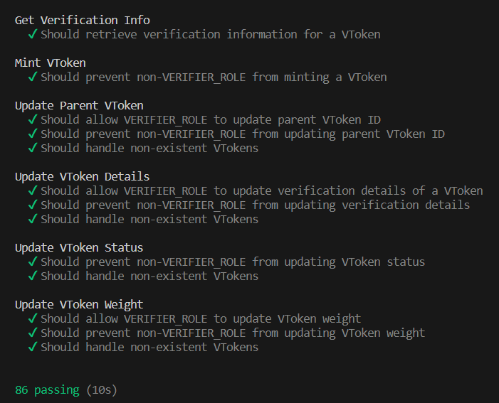

# سیستم اعتبارسنجی و احراز هویت محتوا مبتنی بر توکن‌های غیرقابل معامله (NFT)
این پروژه یک چارچوب مبتنی بر زنجیره‌باز است که بر تقویت اصالت و قابلیت اعتماد محتواهای به اشتراک گذاشته شده در شبکه‌های اجتماعی تمرکز دارد. با بهره‌گیری از توکن‌های غیرقابل معامله (NFT)، این پروژه یک راه‌حل برای ارزیابی اصالت محتوای شبکه‌های اجتماعی فراهم می‌کند.

## ویژگی‌ها
- پیاده‌سازی توکن‌های IToken، CToken و VToken برای مدیریت هویت، محتوا و راستی آزمایی محتوا.
- یکپارچگی با فناوری بلاکچین برای عملیات غیرمتمرکز و شفاف.
- قابل توسعه و تطبیق برای انواع پلتفرم‌های شبکه‌های اجتماعی.

## شروع به کار
این دستورالعمل‌ها یک نسخه از پروژه را برای توسعه و آزمون در دستگاه محلی شما آماده می‌کند.

### پیش‌نیازها
- Node.js
- NPM (مدیر بسته Node)
- Hardhat

### نصب
مراحل زیر به شما می‌گویند چگونه یک محیط توسعه را راه‌اندازی کنید : 

1. ریپازیتوری را کلون کنید:
   ```bash
   git clone https://github.com/mohroba/nft_content_verification.git
   ```

2. به دایرکتوری پروژه بروید:
   ```bash
   cd nft_content_verification
   ```

3. وابستگی‌ها را نصب کنید:
   ```bash
   npm install
   ```

4. قراردادهای هوشمند را کامپایل کنید:
   ```bash
   npx hardhat compile
   ```

### اجرای آزمون‌ها
چگونگی اجرای آزمون‌های خودکار برای این سیستم:
```bash
npx hardhat test
```
#### اثبات آخرین آزمون‌های انجام‌شده



## ساختار پروژه
- `artifacts/`: آرتیفکت‌های قراردادهای هوشمند کامپایل‌شده.
- `cache/`: فایل‌های کش Hardhat.
- `contracts/`: فایل‌های منبع قراردادهای هوشمند.
- `docs/`: فایل‌های مستندات.
- `node_modules/`: بسته‌های NPM.
- `scripts/`: اسکریپت‌های نصب و تعامل.
- `test/`: فایل‌های آزمون قرارداد.


## قدردانی
از افراد، سازمان‌ها و پروژه‌های زیر صمیمانه سپاسگزاری می کنیم که به توسعه این پروژه کمک کرده‌اند:

- **دانشگاه بین‌المللی امام خمینی (ره):** دانشکده مهندسی کامپیوتر.
- **دکتر حمیدرضا حمیدی:** استاد دانشگاه [@IKIU](https://ikiu.ac.ir/) و راهنمای پروژه.

سپاس ویژه از پروژه‌های متن‌باز زیر:

- [OpenZeppelin](https://openzeppelin.com/): برای ارائه کتابخانه‌ها و ابزارهای ارزشمند قراردادهای هوشمند.
- [Hardhat](https://hardhat.org/): یک محیط توسعه قدرتمند برای قراردادهای هوشمند اتریوم.

همچنین از جامعه گسترده بلاکچین و متن‌باز برای ایجاد امکانات توسعه سپاسگزاریم.
```

Feel free to use and modify this translation as needed for your README.md file.

# NFT Based Content Authenticity & Verification System
This project is a blockchain-based framework that focuses on enhancing the authenticity and credibility of content shared on social networks. Leveraging non-fungible tokens (NFTs), this project provides a solution for evaluating the authenticity of social media content.

## Features
- Implementing ITokens, CTokens, and VTokens for identity, content, and verification management.
- Integration with blockchain technology for decentralized and transparent operations.
- Adaptable for various social media platforms.

## Getting Started
These instructions will get you a copy of the project up and running on your local machine for development and testing purposes.

### Prerequisites
- Node.js
- NPM (Node Package Manager)
- Hardhat

### Installing
A step-by-step series of examples that tell you how to get a development environment running.

1. Clone the repository:
   ```bash
   git clone https://github.com/mohroba/nft_content_verification.git
   ```

2. Navigate to the project directory:
   ```bash
   cd nft_content_verification
   ```

3. Install dependencies:
   ```bash
   npm install
   ```

4. Compile the smart contracts:
   ```bash
   npx hardhat compile
   ```

### Running Tests
How to run the automated tests for this system : 
```bash
npx hardhat test
```
#### Proof of last committed tests


## Project Structure
- `artifacts/`: Compiled contract artifacts.
- `cache/`: Hardhat cache files.
- `contracts/`: Smart contract source files.
- `docs/`: Documentation files.
- `node_modules/`: NPM packages.
- `scripts/`: Deployment and interaction scripts.
- `test/`: Contract test files.


## License
This project is licensed under the MIT License - see the [LICENSE.md](LICENSE.md) file for details.

## Acknowledgments

I would like to express our sincere appreciation to the following individuals, organizations, and projects that have contributed to the development this project:

- **IKIU:** Imam Khomeini International University (Faculty of Computer Engineering).
- **Dr.HamidReza Hamidi:** Assitant Professor [@IKIU](https://ikiu.ac.ir/) & Supervisor of the project.


Special thanks to the following open-source projects:

- [OpenZeppelin](https://openzeppelin.com/): For providing valuable smart contract libraries and tools.
- [Hardhat](https://hardhat.org/): A powerful development environment for Ethereum smart contracts.

We are also grateful to the broader blockchain and open-source community for their continuous support and inspiration.
